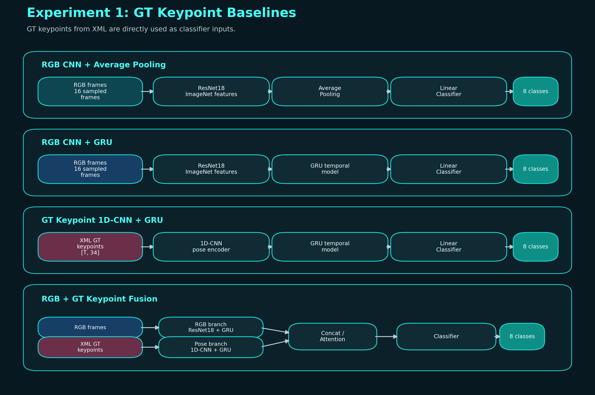
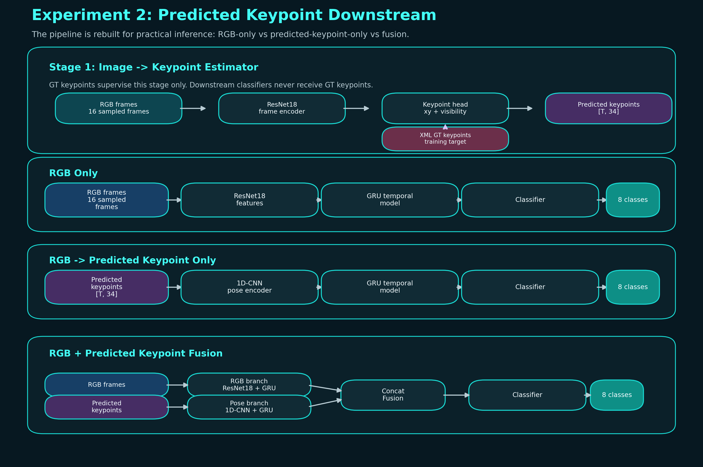

# CCTV 영상과 사람 포즈 정보를 결합한 멀티모달 이상행동 분류

## 1. 프로젝트 개요

본 프로젝트는 AI Hub의 실내 편의점/매장 CCTV 이상행동 데이터를 활용하여, 무인매장 환경에서 발생할 수 있는 이상행동을 자동으로 분류하는 딥러닝 모델을 실험한 것이다.

분류 대상은 총 8개 행동 class이다.

| Class ID | 행동 |
|---:|---|
| 0 | 전도 |
| 1 | 파손 |
| 2 | 방화 |
| 3 | 흡연 |
| 4 | 유기 |
| 5 | 절도 |
| 6 | 폭행 |
| 7 | 이동약자 |

핵심 질문은 다음과 같다.

```text
RGB 영상 정보만 사용하는 것보다 사람 자세 정보(keypoint)를 함께 사용하는 것이 이상행동 분류에 도움이 되는가?
```

이를 확인하기 위해 두 단계의 실험을 진행하였다.

```text
1차 실험: XML에 라벨링된 GT keypoint를 직접 입력으로 사용하는 baseline 비교
2차 실험: RGB 이미지에서 keypoint를 예측한 뒤, predicted keypoint를 downstream 분류에 사용하는 실험
```

## 2. 데이터셋

사용 데이터는 AI Hub의 실내 편의점, 매장 사람 이상행동 데이터이다.

AI Hub 설명 페이지에는 전체 구축량이 6,492 clips로 표기되어 있으나, 실제 로컬에서 MP4 영상과 XML 라벨이 매칭되는 기준으로 확인한 사용량은 5,841 clips였다.

데이터 구조는 다음과 같다.

```text
data/extracted/
  Training/
    videos/
    labels/
  Validation/
    videos/
    labels/

data/processed/
  frames_224/
  frames_224_manifest.csv
  frame_index_224.csv
  frames_224_trainvaltest.csv
```

원본 영상은 대부분 1920x1080 해상도이며 약 3 FPS로 구성되어 있다. XML 라벨에는 행동 시작/종료 프레임, 사람 bbox, 17개 관절 keypoint 좌표가 포함되어 있다.

## 3. 데이터 가공

데이터 가공은 `scripts/data_processing/` 아래에 정리하였다.

```text
scripts/data_processing/extract_aihub_dataset.py
scripts/data_processing/build_manifest.py
scripts/data_processing/inspect_video_fps.py
scripts/data_processing/extract_frames_224.py
scripts/data_processing/build_train_val_test_manifest.py
```

가공 과정은 다음과 같다.

1. AI Hub 압축 파일을 해제하여 MP4/XML 구조를 복원한다.
2. 영상과 XML 라벨이 매칭되는 clip manifest를 생성한다.
3. 원본 영상 FPS, 해상도, 프레임 수, XML 행동 구간을 확인한다.
4. RGB 프레임을 224x224 이미지로 추출한다.
5. AI Hub Training split을 train/validation으로 재분할하고, AI Hub Validation split을 test로 사용한다.

최종 split은 다음과 같다.

| Split | Clip 수 | 설명 |
|---|---:|---|
| train | 4,154 | AI Hub Training 내부 80% |
| validation | 1,037 | AI Hub Training 내부 20% |
| test | 650 | AI Hub Validation 전체 |

학습 시에는 전체 영상이 아니라 XML 행동 구간에서 16프레임을 uniform sampling하여 사용하였다. RGB 입력은 224x224 이미지로 사용하고, keypoint 좌표는 원본 해상도 기준 좌표를 width/height로 나누어 0~1 범위로 정규화하였다.

## 4. 실험 구조 개요

최종 코드 구조는 다음과 같이 정리하였다.

```text
scripts/data_processing/   # 데이터 가공
scripts/experiment1/       # 1차 실험
scripts/experiment2/       # 2차 실험
outputs/experiment1/       # 1차 실험 결과 archive
outputs/experiment2/       # 2차 실험 결과
```

1차 실험과 2차 실험의 가장 큰 차이는 keypoint를 사용하는 방식이다.

```text
1차 실험: XML GT keypoint를 행동 분류 모델에 직접 입력
2차 실험: XML GT keypoint는 pose estimator 학습에만 사용하고, 행동 분류에는 predicted keypoint 사용
```

모델 구조도는 다음과 같다.





Fusion 모델 구조도에서는 RGB 입력과 keypoint 입력을 concat 이전까지 별도 branch로 표시하였다. 두 입력은 각각 ResNet18+GRU branch와 1D-CNN+GRU branch를 통과한 뒤 fusion 단계에서 결합된다.

## 5. 1차 실험: GT Keypoint 기반 Baseline 비교

1차 실험의 목적은 RGB 영상 정보와 GT keypoint 정보의 분류 성능을 비교하는 것이다. 이 실험에서는 XML에 라벨링된 정답 keypoint를 모델 입력으로 직접 사용한다.

비교 모델은 다음과 같다.

| Model | 입력 | 구조 |
|---|---|---|
| CNN + Average Pooling | RGB frame | ResNet18 feature + average pooling |
| CNN + GRU | RGB frame sequence | ResNet18 feature + GRU |
| GT Keypoint 1D-CNN + GRU | XML GT keypoint sequence | 1D-CNN pose encoder + GRU |
| RGB + GT Keypoint Fusion | RGB + XML GT keypoint | RGB branch + pose branch fusion |
| RGB + GT Keypoint Cross-Attention Fusion | RGB + XML GT keypoint | keypoint query, RGB key/value cross-attention |

1차 실험 결과는 기존 non-smoke 결과를 `outputs/experiment1/`에 archive하였다. 최종 보고서에서는 해당 결과를 고정값으로 사용한다.

| Model | Best Epoch | Valid Macro F1 | Test Accuracy | Test Macro F1 |
|---|---:|---:|---:|---:|
| CNN + Average Pooling | 19 | 0.8263 | 0.6323 | 0.6246 |
| CNN + GRU | 17 | 0.9611 | 0.7554 | 0.7547 |
| GT Keypoint 1D-CNN + GRU | 30 | 0.9864 | 0.9492 | 0.9497 |
| RGB + GT Keypoint Fusion | 21 | 0.9805 | 0.8523 | 0.8467 |
| RGB + GT Keypoint Cross-Attention Fusion | 27 | 0.9826 | 0.8646 | 0.8620 |

1차 실험에서 가장 높은 test Macro F1은 GT Keypoint 1D-CNN + GRU 모델의 0.9497이었다. 이는 본 데이터셋에서 사람의 자세 및 움직임 정보가 이상행동 분류에 매우 강력한 특징임을 보여준다.

다만 이 결과는 실제 추론 환경과는 차이가 있다. 실제 CCTV 영상에는 XML GT keypoint가 주어지지 않기 때문이다. 따라서 GT keypoint 기반 결과는 실제 적용 모델이라기보다, pose 정보가 충분히 정확할 때 얻을 수 있는 상한 성능에 가깝게 해석하였다.

## 6. 2차 실험: Predicted Keypoint 기반 Downstream 비교

2차 실험은 1차 실험의 한계를 보완하기 위해 설계하였다. 실제 CCTV 환경에서는 GT keypoint가 제공되지 않으므로, RGB 이미지에서 keypoint를 먼저 예측하고, 그 predicted keypoint를 행동 분류에 사용하는 구조로 파이프라인을 재구성하였다.

2차 실험은 두 단계로 구성된다.

```text
Stage 1: RGB image -> keypoint estimator 학습
Stage 2: downstream action classifier 학습 및 평가
```

Stage 1에서는 XML keypoint를 GT로 사용하여 RGB 이미지에서 17개 관절 좌표와 visibility를 예측하는 모델을 학습하였다. 이 단계의 평가지표는 normalized MPJPE이다. MPJPE는 Mean Per Joint Position Error의 약자로, 예측 관절 좌표와 GT 관절 좌표 사이 평균 거리이다. 본 실험에서는 0~1 정규화 좌표 기준이므로 낮을수록 좋다.

```text
Pose estimator best epoch: 8
Best validation normalized MPJPE: 0.0648
```

Stage 2에서는 pose estimator를 고정한 뒤 다음 세 모델을 비교하였다.

| Model | 입력 | 목적 |
|---|---|---|
| RGB Only | RGB frame sequence | 2차 실험 내부 RGB 기준 성능 |
| RGB -> Predicted Keypoint Only | predicted keypoint sequence | 예측 자세 정보만으로 행동 분류 가능 여부 확인 |
| RGB + Predicted Keypoint Fusion | RGB + predicted keypoint | RGB와 예측 자세 정보의 보완 가능성 확인 |

2차 실험 결과는 다음과 같다.

| Model | Best Epoch | Best Valid Macro F1 | Test Accuracy | Test Macro F1 |
|---|---:|---:|---:|---:|
| RGB Only | 13 | 0.9264 | 0.7231 | 0.7228 |
| RGB -> Predicted Keypoint Only | 13 | 0.7605 | 0.5908 | 0.5980 |
| RGB + Predicted Keypoint Fusion | 15 | 0.9450 | 0.7246 | 0.7270 |

Predicted keypoint-only 모델은 RGB-only보다 낮은 성능을 보였다. 이는 이미지에서 예측한 keypoint가 GT keypoint만큼 안정적이지 않고, keypoint 예측 오차가 downstream 분류 성능에 누적되었기 때문으로 해석된다.

그러나 RGB + predicted keypoint fusion 모델은 RGB-only보다 test Macro F1이 0.7228에서 0.7270으로 소폭 상승하였다. 즉 predicted keypoint는 단독 입력으로는 부족하지만, RGB feature와 결합할 경우 사람 자세 정보를 보완적으로 제공할 수 있음을 확인하였다.

## 7. 1차 실험과 2차 실험 비교

1차와 2차 실험은 직접적인 수치 비교보다 실험 목적의 차이를 중심으로 해석해야 한다.

| 구분 | 1차 실험 | 2차 실험 |
|---|---|---|
| Keypoint 사용 방식 | GT keypoint 직접 입력 | RGB에서 예측한 keypoint 사용 |
| 목적 | pose 정보의 잠재력 확인 | 실제 추론 환경에 가까운 구조 확인 |
| 가장 중요한 결과 | GT keypoint-only가 최고 성능 | fusion이 RGB-only보다 소폭 개선 |
| 한계 | 실제 CCTV에는 GT keypoint 없음 | pose estimator 오차가 분류 성능에 영향 |

핵심 결론은 다음과 같다.

```text
GT keypoint는 이상행동 분류에 매우 강력한 정보이다.
하지만 실제 환경에서는 GT keypoint가 없으므로, predicted keypoint 품질이 전체 성능의 병목이 된다.
Predicted keypoint는 단독으로는 RGB보다 약하지만, RGB와 fusion하면 보완 정보로 작동할 가능성이 있다.
```

## 8. 2차 실험의 개선점

2차 실험은 기존 1차 실험 대비 다음과 같은 개선점을 가진다.

1. 실제 추론 환경 반영

GT keypoint를 행동 분류기에 직접 넣지 않고, RGB 이미지에서 keypoint를 예측한 뒤 사용하였다. 따라서 실제 CCTV 입력 상황에 더 가까운 실험이다.

2. RGB-only 기준 모델 추가

2차 실험 내부에서 RGB-only, predicted keypoint-only, fusion을 동일한 조건으로 새로 학습하여 predicted keypoint의 기여 여부를 비교할 수 있게 하였다.

3. Fusion 구조의 실용적 해석 가능

Fusion 모델은 RGB 장면 정보와 predicted pose 정보를 동시에 사용한다. test Macro F1 기준으로 RGB-only보다 소폭 높은 성능을 보여, predicted keypoint가 보조 정보로 작동할 가능성을 확인하였다.

## 9. 한계 및 향후 개선 방향

현재 2차 실험의 fusion 개선 폭은 크지 않다. 이는 predicted keypoint의 품질이 GT keypoint만큼 안정적이지 않고, 단순 concat fusion이 keypoint 예측 오차를 충분히 제어하지 못했기 때문일 수 있다.

향후 개선 방향은 다음과 같다.

- pose estimator를 더 강한 구조로 개선한다.
- ResNet18 backbone 일부를 unfreeze하여 CCTV 도메인에 fine-tuning한다.
- keypoint confidence 또는 visibility를 fusion weight에 반영한다.
- 단순 concat 대신 cross-attention 또는 gating 기반 fusion을 적용한다.
- pose estimator와 action classifier를 end-to-end fine-tuning한다.
- class별로 RGB와 pose가 기여하는 정도를 분석한다.

## 10. 최종 결론

본 프로젝트에서는 CCTV 이상행동 분류에서 RGB 영상 정보와 사람 자세 정보의 역할을 비교하였다.

1차 실험에서는 GT keypoint 기반 모델이 가장 높은 성능을 보여, 자세 정보가 이상행동 분류에 매우 중요한 특징임을 확인하였다.

2차 실험에서는 실제 추론 환경에 맞게 RGB 이미지에서 keypoint를 예측한 뒤 downstream 분류에 사용하였다. 이때 predicted keypoint-only는 RGB-only보다 낮았지만, RGB + predicted keypoint fusion은 RGB-only보다 test Macro F1을 소폭 개선하였다.

따라서 최종 결론은 다음과 같다.

```text
사람 자세 정보는 이상행동 분류에 유효하다.
다만 실제 적용에서는 GT keypoint가 없으므로 keypoint 예측 품질이 중요하다.
예측된 keypoint는 단독으로는 불완전하지만, RGB와 결합하면 보완적인 정보로 활용될 수 있다.
```

## 11. 재현 명령

1차 실험 결과는 고정 archive를 사용한다.

```text
outputs/experiment1/README.md
```

2차 실험 재실행 명령은 다음과 같다.

```powershell
.\.venv5070\Scripts\python.exe scripts\experiment2\run_experiment2.py --pose-epochs 8 --classifier-epochs 15 --batch-size 32
```

로그 저장 포함 실행 명령은 다음과 같다.

```powershell
.\.venv5070\Scripts\python.exe scripts\experiment2\run_experiment2.py --pose-epochs 8 --classifier-epochs 15 --batch-size 32 2>&1 | Tee-Object outputs\experiment2\train_log.txt
```
